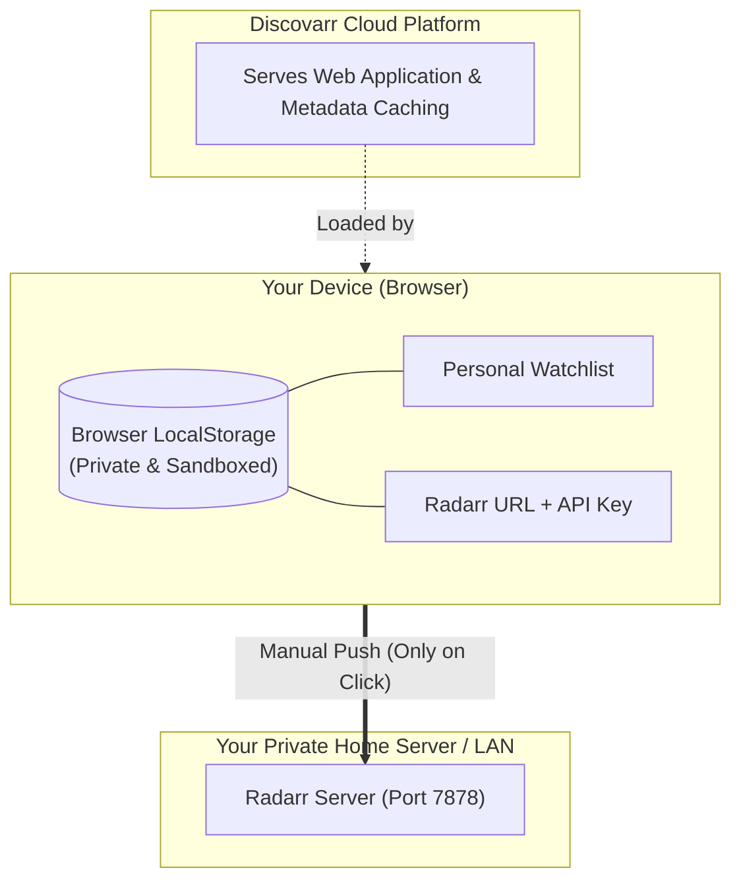

<div align="center">

# 🎬 Discovarr

**The privacy-first, swipe-based movie discovery engine with seamless manual Radarr integration.**

<br />

<a href="https://discovarr.brandez.online">
  
</a>

<br /><br />

[](https://discovarr.brandez.online)
[](#-local-first--privacy-architecture)
[](#-local-first--privacy-architecture)
[](#-radarr-integration-guide)

</div>

---

## 🚀 Live Web App

Discovarr is available instantly in your web browser with zero installation:

👉 **[https://discovarr.brandez.online](https://discovarr.brandez.online)**

---

## 💡 What is Discovarr?

**Discovarr** is a smart movie discovery engine designed to solve movie decision fatigue. Instead of endlessly scrolling through overwhelming grids or traditional streaming catalog carousels, Discovarr presents a distraction-free, card-swiping experience.

Curate your personal watchlist from the couch, and with a single click in your **My List** section, push your discovered films directly to your self-hosted **Radarr** library.

---

## 🛡️ Local-First & Privacy Architecture

Discovarr was engineered from day one with a strict **local-first, zero-knowledge** architecture. We believe home media servers and personal movie preferences should remain strictly private.



### Key Privacy Principles:
1. **Zero Accounts & Zero Sign-Ins**: No registration, no passwords, and no email addresses required.
2. **Device-Level Storage**: Your Radarr URL, API Key, default Root Folders, Quality Profiles, and watchlist stay strictly inside your browser (`localStorage`).
3. **Zero Server-Side Retention**: Our servers never save, record, or track your home IP addresses, Tailscale IPs, or API keys.
4. **No Automated Background Polling**: Radarr never pulls data in the background. Movies are sent **only when you explicitly click** "Push to Radarr" or "Push All to Radarr" from your watchlist.
5. **Instant Disconnect**: Click "Disconnect" in the settings modal at any time to wipe your credentials from your browser immediately.

---

## ✨ Features

- **Tinder-Style Movie Discovery**: Fluid swipe gestures on mobile, keyboard shortcuts (`Left` / `Right` arrows) on desktop.
- **Smart Filtering & Roulette**: Filter by genres, release year, streaming availability, or trigger the *Surprise Me* roulette engine.
- **Watch Together**: Generate a private matching link to find movies that both you and a partner swipe right on.
- **Deep Film Details**: High-definition trailers, cast filmography, IMDb & TMDB ratings, parental guidance advisories, and subtitles.
- **Dual-URL Radarr Failover**: Automatic switching between your Primary Home LAN address and your Fallback remote/Tailscale address.
- **Bulk & Single Push**: Push individual titles or sync your entire watchlist in seconds with real-time status indicators (`In Radarr ✓`).

---

## 📡 Radarr Integration Guide

Connecting Discovarr to your Radarr instance takes less than 30 seconds:

### Step 1: Obtain your Radarr API Key
1. Open your **Radarr** dashboard.
2. Navigate to **Settings ➔ General ➔ Security**.
3. Copy your 32-character **API Key**.

### Step 2: Configure Discovarr
1. Open Discovarr and click the **Lists** tab.
2. Click the **Radarr** button in the header to open the settings drawer.
3. Enter your connection details:
   - **Primary URL (Home LAN)**: Your local network address, e.g.:
     ```
     http://192.168.1.50:7878
     ```
   - **Fallback URL**: Your remote or Tailscale address, e.g.:
     ```
     http://100.x.y.z:7878
     ```
     *(Or your secure HTTPS domain, like `https://radarr.yourdomain.com`)*
   - **API Key**: Paste your copied key.
4. Click **"Test Connection & Fetch Options"**.
   - Discovarr will perform a handshake, verify connectivity, and auto-populate your Radarr **Quality Profiles** and **Root Folders**.
5. Select your default preferences, choose whether to search indexers immediately, and click **Save Settings**.

---

## 🚀 How Pushing Works

Discovarr gives you total control over what enters your library:

- **Single Movie**: Tap the **Server / Push** icon on any card in your Watchlist. Discovarr dispatches a direct API request to your Radarr instance.
- **Push All to Radarr**: Click **"Push All to Radarr (X)"** at the top of your Watchlist to queue all unpushed movies sequentially with live progress feedback.
- **Duplicate Prevention**: If a movie already exists in your Radarr library, Discovarr detects it and badges it as `Already in Radarr ✓` without causing duplicate downloads.

---

## ❓ Frequently Asked Questions (FAQ)

<details>
<summary><strong>Is it safe to use Discovarr with my private Radarr server?</strong></summary>

Yes. Your API key and server address are never transmitted to any central database. When you click "Push to Radarr", the request is dispatched directly between your browser and your server (using an internal relay to avoid browser mixed-content restrictions).
</details>

<details>
<summary><strong>Why does Discovarr support two URLs (Primary + Fallback)?</strong></summary>

Most self-hosters keep their servers on a private local IP (`192.168.x.x`) when connected to home Wi-Fi, but use **Tailscale** or a reverse proxy when away from home. Discovarr tests your Primary LAN URL first; if unreachable, it seamlessly fails over to your Fallback URL so your discovery experience remains uninterrupted.
</details>

<details>
<summary><strong>Does Discovarr download the movie files?</strong></summary>

No. Discovarr is solely a movie discovery engine. When you push a title to Radarr, Radarr handles indexer searching, torrent/usenet client integration, and file management according to your configured quality profiles.
</details>

<details>
<summary><strong>Why is Discovarr a hosted service rather than an open-source Docker container?</strong></summary>

Discovarr is hosted centrally so that movie lovers don't have to manage another container, reverse proxy, or TMDB API key just to find what to watch. Central hosting allows high-speed metadata caching and seamless mobile usage, while our **local-first architecture** ensures your personal library credentials remain 100% private on your own device.
</details>

---

## 💬 Community & Feedback

- **Feature Requests & Bug Reports**: Open an issue on this repository via [GitHub Issues](https://github.com/JoeTinnySpace/discovarr/issues).
- **Discussions & Feedback**: Share your homelab setup, suggest new filtering features, or vote on upcoming roadmap additions.

---

<div align="center">
  <sub>Discovarr is built with ❤️ for film lovers and the homelab community.</sub>
</div>
